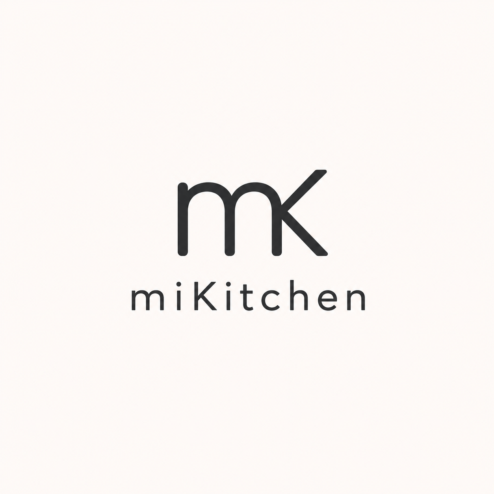

<!-- markdownlint-disable MD033 -->

# Proyecto Final Mobile - miKitchen

Aplicación móvil desarrollada con **Expo**, **React Native** y **TypeScript** para gestionar recetas de cocina de manera local.

El proyecto fue realizado como Trabajo Práctico Integrador de la materia **Desarrollo de Aplicaciones para Dispositivos Móviles**. La app permite registrar usuarios, iniciar sesión, crear recetas, visualizarlas, editarlas, eliminarlas, marcarlas como favoritas, buscar por título o ingrediente, cargar imágenes y utilizar un timer de cocción como apoyo durante la preparación.

---

<div align="center">
  
</div>
---
## Descripción general

**miKitchen** funciona como un recetario digital personal. Cada usuario puede acceder a sus propias recetas y administrarlas desde una interfaz visual, simple y adaptada tanto para dispositivo móvil como para navegador web.

El código está separado por pantallas, componentes, navegación, datos y tipos para que sea más fácil de leer y explicar durante la defensa.

---

## Funcionalidades principales

- Registro de usuario local.
- Inicio y cierre de sesión.
- Visualización de recetas por usuario.
- Creación de nuevas recetas.
- Visualización del detalle de cada receta.
- Edición de recetas existentes.
- Eliminación de recetas con modal de confirmación.
- Marcado y desmarcado de recetas favoritas.
- Pantalla específica para recetas favoritas.
- Organización por categorías.
- Búsqueda de recetas por título e ingredientes.
- Badge en la pestaña de recetas con la cantidad total de recetas cargadas.
- Carga de imagen desde galería.
- Carga de imagen usando cámara.
- Visualización ampliada de imagen en el detalle de receta.
- Timer de cocción con selector de minutos y segundos.
- Feedback háptico en acciones relevantes.
- Alerta y sonido al finalizar el timer.
- Diseño visual consistente con cards, fondo personalizado y navegación inferior.
- Compatibilidad probada en Expo Go para iPhone y en navegador web.

---

## Tecnologías utilizadas

- Expo
- React Native
- TypeScript
- React
- React Navigation
- Bottom Tab Navigator
- Native Stack Navigator
- Context API
- AsyncStorage
- Expo Image Picker
- Expo Haptics
- Expo Audio
- Expo Vector Icons / Ionicons
- React Native Picker

---

## Estructura general del proyecto

```txt
ProyectoFinalMobile/
│
├── src/
│   │
│   ├── assets/
│   │   ├── recipes/
│   │   │
│   │   ├── sounds/
│   │   │
│   │   ├── adaptive-icon.png
│   │   ├── favicon.png
│   │   ├── icon.png
│   │   ├── italian-tablecloth.png
│   │   └── splash-icon.png
│   │
│   ├── components/
│   │   ├── EmptyState.tsx
│   │   ├── FormInput.tsx
│   │   ├── ItalianTableclothBackground.tsx
│   │   ├── PrimaryButton.tsx
│   │   ├── RecipeCard.tsx
│   │   ├── Section.tsx
│   │   ├── SummaryCard.tsx
│   │   └── TableclothCard.tsx
│   │
│   ├── data/
│   │   ├── AuthContext.tsx
│   │   ├── initialRecipes.ts
│   │   ├── initialUsers.ts
│   │   └── RecipesContext.tsx
│   │
│   ├── navigation/
│   │   ├── AppNavigator.tsx
│   │   └── types.tsx
│   │
│   ├── screens/
│   │   ├── CategoriesScreen.tsx
│   │   ├── FavoriteRecipesScreen.tsx
│   │   ├── HomeScreen.tsx
│   │   ├── LoginScreen.tsx
│   │   ├── RecipeDetailScreen.tsx
│   │   ├── RecipeFormScreen.tsx
│   │   ├── RecipeListScreen.tsx
│   │   ├── SettingsScreen.tsx
│   │   ├── SignupScreen.tsx
│   │   └── TimerScreen.tsx
│   │
│   ├── types/
│   │   ├── recipe.tsx
│   │   └── user.ts
│   │
│   └── utils/
│       └── recipeHelpers.tsx
│
├── .gitignore
├── App.tsx
├── app.json
├── ideas.md
├── index.ts
├── package.json
├── package-lock.json
└── README.md
```

---

## Organización del código

El proyecto está organizado separando responsabilidades para mejorar la legibilidad y el mantenimiento.

### `components`

Contiene componentes reutilizables de la interfaz, como botones, inputs, tarjetas de recetas, fondos visuales y estados vacíos.

### `screens`

Contiene las pantallas principales de la app. Cada pantalla representa una vista funcional del proyecto, por ejemplo inicio, listado de recetas, detalle, formulario, favoritos, categorías, timer o ajustes.

### `data`

Contiene la lógica de estado global mediante Context API. En esta carpeta se manejan los usuarios, las recetas y los datos iniciales.

### `navigation`

Contiene la configuración de navegación principal de la app. Se utiliza navegación por tabs para las secciones principales y navegación por stack para el flujo interno de recetas.

### `types`

Contiene tipos TypeScript compartidos, especialmente el tipo principal `Recipe`.

---

## Navegación

La app utiliza **React Navigation** con dos niveles principales.

### Navegación por tabs

Permite moverse entre las secciones principales:

- Inicio
- Recetas
- Timer
- Ajustes

La pestaña de recetas incluye un badge visual con la cantidad total de recetas cargadas.

### Navegación por stack

Dentro de la sección de recetas se utiliza un stack para navegar entre:

- Listado de recetas
- Recetas favoritas
- Detalle de receta
- Crear receta
- Editar receta
- Categorías

Esta estructura permite mantener una navegación ordenada y separar el flujo principal del flujo específico de recetas.

---

## CRUD de recetas

La app implementa un CRUD completo sobre recetas.

### Crear

El usuario puede crear una receta cargando:

- Título
- Categoría
- Descripción
- Tiempo de cocción
- Imagen
- Ingredientes
- Pasos de preparación

### Leer

Las recetas se visualizan desde el listado principal mediante una `FlatList`. Cada receta puede abrirse en una pantalla de detalle donde se muestran sus datos completos.

### Editar

Desde el detalle de una receta se puede acceder a la pantalla de edición. El formulario se reutiliza tanto para crear como para editar, diferenciando el comportamiento mediante un modo interno.

### Eliminar

La eliminación se realiza desde el detalle de la receta mediante un modal de confirmación. Esto evita eliminaciones accidentales y mejora la compatibilidad entre mobile y web.

---

## Búsqueda de recetas

La pantalla de recetas incluye un buscador que permite filtrar el listado por:

- Título de la receta.
- Ingredientes.

La búsqueda normaliza el texto para evitar problemas con mayúsculas, minúsculas y tildes. Por ejemplo, una búsqueda como `pure` puede encontrar resultados que contengan `puré`.

Si no hay coincidencias, la app muestra un estado vacío con un mensaje claro para el usuario.

---

## Manejo de usuarios

La app cuenta con registro e inicio de sesión local.

Cada receta queda asociada al usuario que la creó. De esta manera, al iniciar sesión con distintos usuarios, cada uno puede ver únicamente sus propias recetas.

La autenticación fue implementada con fines académicos y funciona de manera local dentro de la aplicación.

---

## Persistencia y datos

El proyecto trabaja con datos locales dentro de la aplicación. Las recetas se administran mediante Context API y estructuras de estado.

Si el proyecto tiene AsyncStorage activo en `RecipesContext` o `AuthContext`, las recetas y usuarios se conservan localmente en el dispositivo. En ese caso, la persistencia es local por dispositivo y no existe sincronización automática entre celulares, navegador o emuladores.

Para sincronización real entre dispositivos sería necesario incorporar un backend, una base de datos remota o un servicio externo como Firebase o Supabase.

---

## Compatibilidad mobile y web

La app fue probada en:

- Expo Go en iPhone.
- Navegador web desde PC.

Durante el desarrollo se ajustaron diferencias entre mobile y web. Por ejemplo, el feedback háptico se utiliza en dispositivos compatibles, pero no bloquea el funcionamiento general de la app cuando se ejecuta desde navegador.

También se ajustó el espaciado inferior de la navegación para mejorar la visualización en dispositivos con botones o gestos del sistema operativo.

---

## Uso de imágenes

La app permite cargar imágenes en recetas mediante:

- Galería del dispositivo.
- Cámara del dispositivo.

Para esto se utiliza **Expo Image Picker**.

Las recetas precargadas también pueden utilizar imágenes locales almacenadas dentro de la carpeta de assets.

En la pantalla de detalle, la imagen puede visualizarse en mayor tamaño para mejorar la experiencia de uso.

---

## Timer de cocción

El proyecto incluye una pantalla de timer que permite controlar tiempos de cocción mediante selección de minutos y segundos.

El timer muestra el tiempo restante, permite iniciar, detener y reiniciar la selección. Al finalizar, la app muestra una alerta, reproduce un sonido y utiliza feedback háptico cuando el dispositivo lo permite.

Esta funcionalidad complementa el objetivo principal del recetario, ya que permite usar la app como apoyo durante la preparación de recetas.

---

## Diseño e interfaz

La app utiliza un diseño visual consistente basado en:

- Fondo personalizado con estilo de mantel.
- Cards para organizar contenido.
- Encabezados visuales consistentes entre pantallas.
- Botones principales con sombra y efecto de presión.
- Navegación inferior con iconos.
- Estados vacíos para listas sin contenido.
- Scroll en pantallas con contenido extenso.

Las pantallas principales mantienen una estructura visual similar para que la app se perciba como un producto unificado.

---

## Próximas incorporaciones

Como evolución futura, miKitchen podría sumar packs temáticos de recetas, por ejemplo:

- Cocina sin TACC.
- Cenas románticas.
- Comida china casera.
- Pastelería profesional.

Cada pack podría ofrecer recetas guiadas con ingredientes, pasos, fotos, categorías, tiempos de cocción y timer integrado.

Esta funcionalidad se plantea como una posible expansión comercial o modelo premium, no como una función actualmente implementada.

---

## Uso de inteligencia artificial

Durante el desarrollo utilicé ChatGPT como herramienta de apoyo para revisar errores, ordenar tareas, mejorar explicaciones técnicas y evaluar alternativas de implementación.

La IA se usó principalmente para:

- Analizar errores de TypeScript, React Native y navegación.
- Revisar estructura de componentes y JSX.
- Pensar mejoras de usabilidad y diseño visual.
- Redactar y corregir documentación técnica.
- Preparar explicaciones para la defensa oral.

El código fue adaptado, probado y validado manualmente en el proyecto. Las decisiones finales de implementación fueron realizadas por mí.

---

## Cómo ejecutar el proyecto

Primero instalar las dependencias:

```bash
npm install
```

Luego iniciar Expo:

```bash
npx expo start
```

Desde Expo se puede ejecutar la app en:

- Expo Go en un dispositivo móvil.
- Navegador web.
- Emulador Android o iOS, si está configurado.

---

## Dependencias principales

Algunas dependencias relevantes del proyecto son:

```txt
@expo/metro-runtime
@expo/vector-icons
@react-native-async-storage/async-storage
@react-native-picker/picker
@react-navigation/bottom-tabs
@react-navigation/native
@react-navigation/native-stack
expo
expo-audio
expo-haptics
expo-image-picker
expo-status-bar
react
react-native
react-native-safe-area-context
react-native-screens
react-native-web
```

---

## Estado actual del proyecto

El proyecto cuenta con:

- CRUD completo de recetas.
- Manejo de usuarios.
- Recetas por usuario.
- Recetas favoritas.
- Categorías.
- Buscador por título e ingredientes.
- Badge con cantidad de recetas en la navegación inferior.
- Carga de imágenes desde cámara o galería.
- Timer de cocción.
- Feedback visual, háptico y sonoro.
- Navegación por tabs y stack.
- Diseño visual consistente entre pantallas.
- Compatibilidad probada en iPhone con Expo Go y navegador web.
- README documentado para entrega y defensa.

---

## Limitaciones conocidas

- La autenticación es local y fue implementada con fines académicos.
- No utiliza backend ni base de datos remota.
- No existe sincronización entre distintos dispositivos.
- Los datos pueden perderse si se limpia el almacenamiento local de la app, del navegador o de Expo Go.
- Las próximas incorporaciones, como packs temáticos de recetas, están planteadas como evolución futura y no como funcionalidad activa.

---

## Posibles mejoras futuras

- Incorporar una base de datos remota.
- Agregar sincronización entre dispositivos.
- Implementar autenticación real con backend.
- Agregar packs temáticos de recetas.
- Filtrar recetas por categoría desde el listado principal.
- Agregar búsqueda avanzada combinando título, ingredientes, categoría y favoritos.
- Permitir editar imágenes ya cargadas con más opciones.
- Agregar exportación o impresión de recetas.
- Mejorar validaciones del formulario.
- Agregar tests automatizados.

---

## Creado por

Proyecto desarrollado por **Ignacio Vidal** como trabajo final de la materia **Desarrollo de Aplicaciones para Dispositivos Móviles** 2026.
